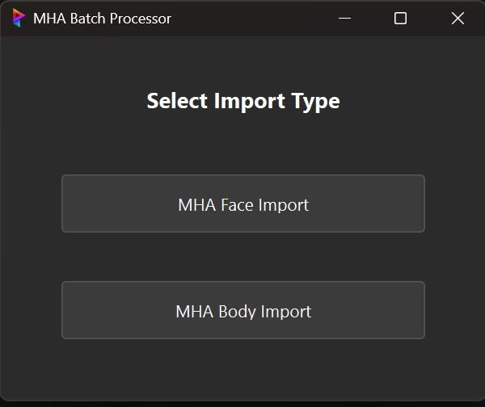
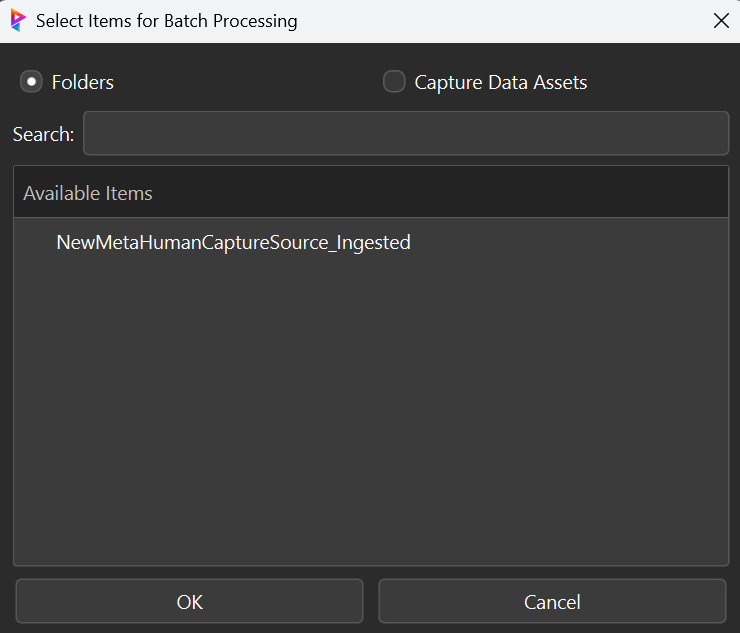
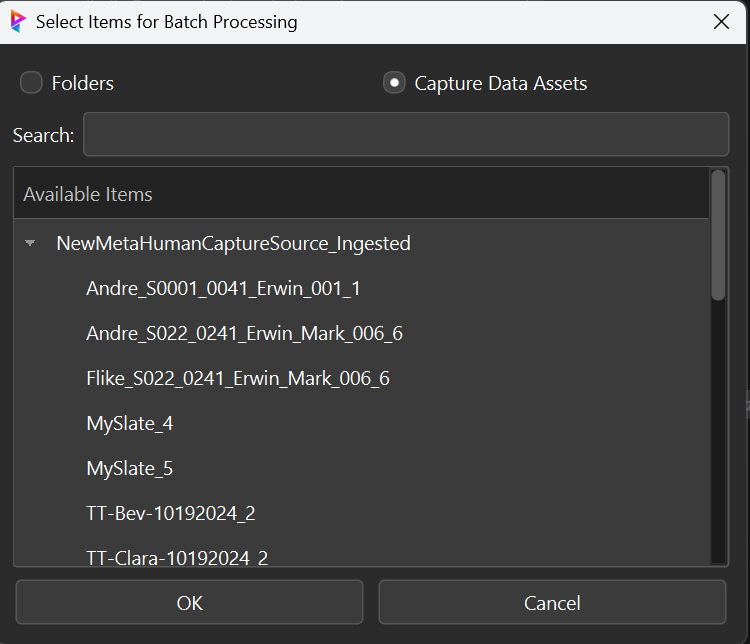
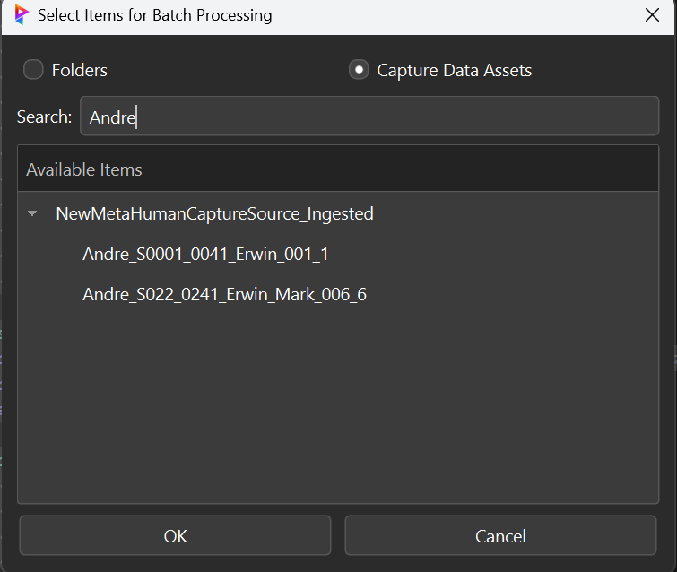
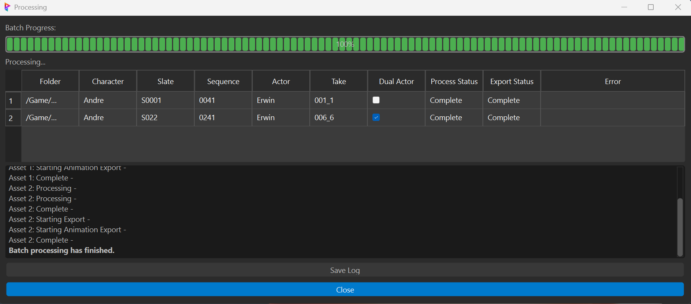
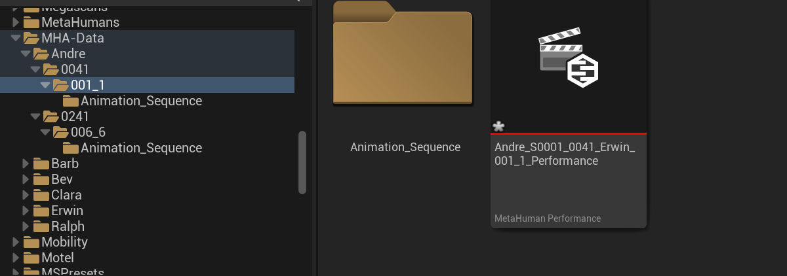
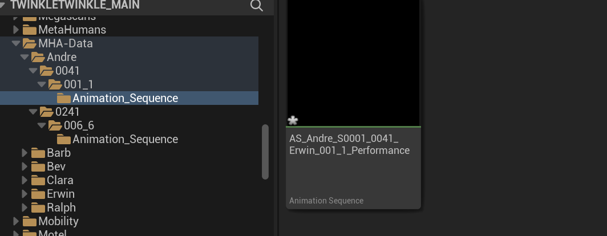

# MetaHuman Automation (MHA) Batch Importer

  
  
  

**Automate importing raw mocap data into Unreal Engine MetaHumans with ease.**

A high-performance, production-grade automation tool for batch processing MetaHuman assets in Unreal Engine. This pipeline tool streamlines the integration of MetaHuman face and body animations from raw mocap datainto your Unreal Engine projects, featuring robust error handling, progress tracking, and seamless FTrack integration.

## Key Features

### Animation Processing
- **Dual Processing Pipelines**
  - Face Animation Import & Processing
  - Body Animation Import & Processing
  - Parallel Processing Support

### Pipeline Integration
- **Unreal Engine Integration**
  - Direct API Integration via Python
  - Automated Import Settings Configuration
  - Real-time Progress Monitoring

- **Asset Management**
  - FTrack Integration with Custom Attributes
  - Automated Asset Organization
  - Batch Processing with Error Recovery
  - Configurable Asset Naming Conventions

### User Interface
- **Modern Qt-based Interface**
  - Real-time Progress Tracking
  - Detailed Processing Logs
  - Interactive Asset Selection
  - Error Visualization and Reporting

---

## Technical Architecture

```
MHA_Batch_Importer/
├── processing/      # Core processing logic for face/body data
│   ├── face/        # Face animation processing
│   ├── body/        # Body animation processing
│   └── base/        # Shared processing logic
├── gui/             # UI components using PySide6
├── integrations/    # FTrack & external tool integrations
└── config/          # Settings & environment configurations
```

---

## Usage Guide

1. **Select Import Type**  
   Choose between face or body animation import modes:
   

2. **Input Selection**  
   Either select folders for bulk import:
   

   Or choose specific capture data assets:
   

3. **Asset Search**  
   Use the search functionality to filter assets:
   

4. **Processing**  
   Monitor real-time import progress:
   

5. **Completion**  
   Review completed imports:
   

6. **Results in Unreal Engine**  
   Processed performance in the engine:
   

   Generated animation sequence:
   

---

## Technical Details

### Face Processing Pipeline
```python
# Key processing steps
1. Asset Discovery & Validation
2. Metadata Extraction & Mapping
3. Import Settings Configuration
4. Processing Queue Management
5. Error Handling & Recovery
```

### Body Processing Pipeline
```python
# Processing workflow
1. FBX Import Configuration
2. Skeletal Mesh Mapping
3. Animation Data Processing
4. Asset Organization
5. Quality Validation
```

---

## Technical Requirements

### Software Dependencies
- **Core**
  - Unreal Engine 5.1+
  - Python 3.7+
  - PySide6 for UI
  - FTrack Python SDK

- **Development Tools**
  ```bash
  # Install core dependencies
  pip install -e .[dev]

  # Install development tools
  pip install pre-commit black flake8 pytest
  ```

---

## Pipeline Integration

### FTrack Setup
```python
# Required Custom Attributes
{
    'actor_names': 'Text',
    'mhid_path': 'Text',
    'skeletal_mesh_path': 'Text'
}
```

### Environment Configuration
```bash
# Core Settings
FTRACK_SERVER="your_server"
FTRACK_API_KEY="your_key"
FTRACK_API_USER="your_user"
FTRACK_PROJECT_ID="your_project"

# Optional Settings
MHA_DEBUG_MODE="True"
MHA_PARALLEL_PROCESSING="True"
```

---

## Quality Assurance

### Automated Testing
```bash
# Run test suite
pytest

# Style checks
flake8 .
black .
isort .
```

### Error Handling
- Comprehensive error capture and logging
- Automated error recovery mechanisms
- Detailed error reporting in UI
- Pipeline status notifications

---

## Performance Optimization

### Processing Optimization
- Parallel processing support
- Efficient asset discovery
- Optimized import settings
- Memory management

### UI Performance
- Asynchronous updates
- Efficient progress tracking
- Responsive user interface
- Real-time status updates

---

## Usage Examples

### Python Console
```python
import mha_batch_importer
mha_batch_importer.run()
```

### Editor Utility Widget
```python
# Add to clicked event
import mha_batch_importer
mha_batch_importer.run()
```

---

## Security Considerations

- Secure credential management
- Access control integration
- Data validation and sanitization
- Error message sanitization

---

## Documentation

For detailed documentation on implementation, customization, and troubleshooting, please refer to the inline code documentation.

---

## Authors

- **Eric Fields**  
  _Pipeline Developer_  
  [efieldsvfx@gmail.com](mailto:efieldsvfx@gmail.com)  
  [GitHub Portfolio](https://github.com/efieldsvfx)

---

## License

This project is licensed under the MIT License - see the [LICENSE](LICENSE) file for details.