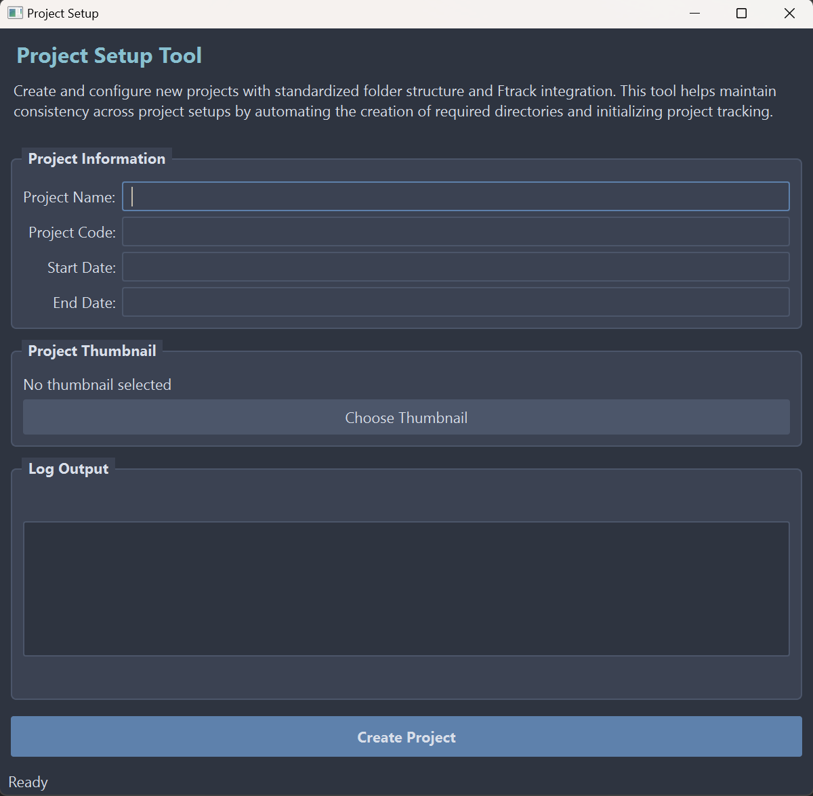
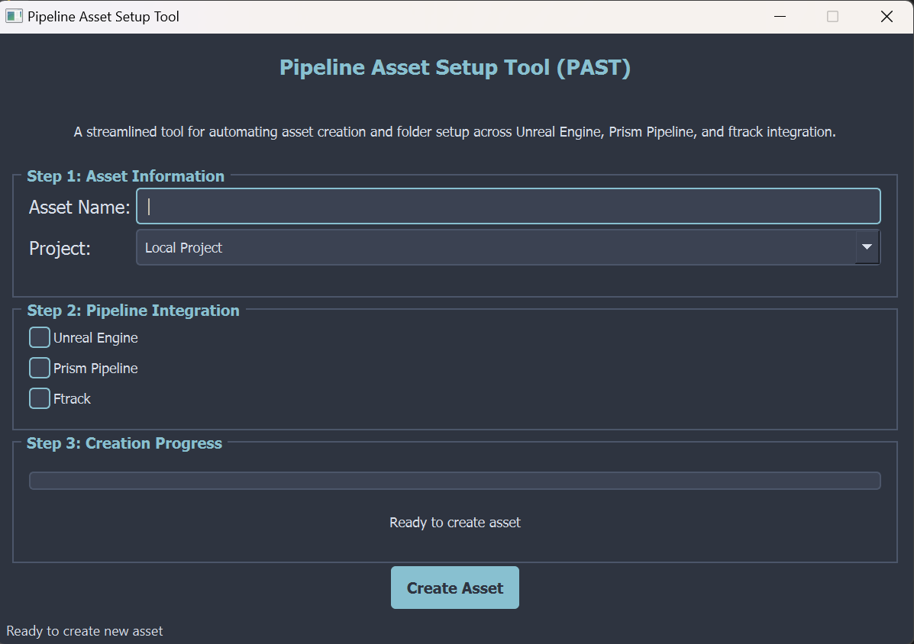

# Pipeline Production Tools

A comprehensive suite of pipeline automation tools for VFX and game production workflows. Last Updated: December 19, 2024

## Tools Overview

### Project Setup Tool (`Project_setup.py`)
Advanced project initialization system featuring:



- **Project Management**
  - Automated folder structure creation
  - ftrack project integration
  - Custom project configuration
  - Thumbnail processing

- **User Interface**
  - Modern Qt-based interface
  - High DPI support
  - Dark theme with Nord color scheme
  - Status tracking and notifications

- **Configuration**
  - JSON-based configuration
  - Customizable folder structures
  - ftrack server settings
  - Error handling and logging

### Asset Creator (`asset_creator.py`)
Professional asset management system with:



- **Asset Management**
  - Multiple asset type support (Character, Prop, Set, Vehicle, Weapon)
  - Standardized naming conventions
  - Automated folder structure creation
  - Version control integration

- **Pipeline Integration**
  - ftrack asset tracking
  - Unreal Engine setup
  - Prism pipeline integration
  - Multi-DCC workflow support

- **Asset Structure**
  - Source file organization (Maya, ZBrush, Substance)
  - Publishing system
  - Unreal Engine asset management
  - Prism workflow integration

## Features

### Project Management
- Automated project setup
- Standardized folder structures
- Asset type templates
- Progress tracking

### Pipeline Integration
- ftrack API integration
- Unreal Engine workflow
- Prism pipeline support
- Multi-DCC compatibility

### User Interface
- Modern Qt-based interfaces
- High DPI support
- Progress tracking
- Error handling
- Status notifications

## Installation

1. Install required dependencies:
```bash
pip install PyQt5 Pillow ftrack-api python-dotenv
```

2. Configure environment variables:
```env
FTRACK_SERVER=your_server_url
FTRACK_API_KEY=your_api_key
FTRACK_API_USER=your_username
```

## Usage

### Project Setup
```python
from Pipeline_tools import Project_setup
Project_setup.main()
```

### Asset Creation
```python
from Pipeline_tools import asset_creator
asset_creator.main()
```

## Configuration

### Project Setup
Configure in `config.json`:
- Root path settings
- ftrack credentials
- Folder structure templates

### Asset Creator
Supports configuration for:
- Asset types and templates
- Naming conventions
- Unreal Engine settings
- Prism pipeline integration

## Requirements
- Python 3.7+
- PyQt5
- ftrack API
- Pillow
- python-dotenv

## Support
For issues, feature requests, or pipeline support, contact the pipeline team.

## License
Internal use only - All rights reserved.
