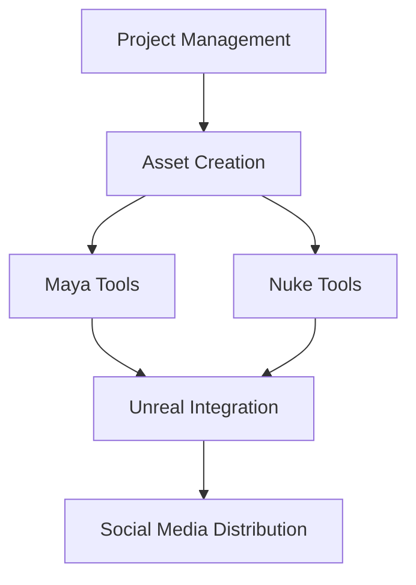

# 🎬 Production Pipeline Tools Suite


Last Updated: December 19, 2024

A comprehensive collection of production-grade tools designed for professional VFX and game development pipelines. This suite demonstrates advanced pipeline development capabilities including multi-threading, real-time processing, and seamless integration with industry-standard tools.

> **Note on Portfolio Scope**: This repository contains a curated selection of production tools that are available for public sharing. Due to Non-Disclosure Agreements (NDAs) and proprietary company standards, many production scripts from my professional work cannot be included. The tools presented here represent my approach to pipeline development while respecting intellectual property rights and confidentiality requirements of previous employers.

## 🎯 Pipeline Overview



## 🛠️ Tool Suites

### 🎨 Maya Tools
Professional-grade Maya automation toolkit featuring:
- **Scene Cleanup Utility**
  - Intelligent scene optimization with backup system
  - Material and plugin management
  - Render layer optimization
  - Modern Qt-based interface with preview functionality
- **Frame Range Manager**
  - ShotGrid pipeline integration
  - Automated frame range synchronization
  - Comprehensive error handling and logging
  - Batch processing support
- **Safety Features**
  - Automatic scene backups
  - Protected node preservation
  - Detailed logging system
  - Non-blocking notifications

### 🎬 Nuke Tools
Professional-grade Nuke compositing toolkit featuring:
- **Node Validation & Analysis**
  - Automated node graph validation
  - Performance optimization
  - Batch processing capabilities
  - Custom validation rules
  - Backup management system
- **Advanced Debugging Suite**
  - Thread and memory optimization
  - System resource monitoring
  - Node state management
  - Comprehensive logging
  - Qt-based debug interface
- **Production Workflow Tools**
  - UI element restoration
  - Layout optimization
  - Custom panel management
  - Progress tracking
  - Error handling and recovery

### 🔧 Pipeline Tools
Core infrastructure components providing:
- **Project Management**
  - Automated project setup
  - Standardized folder structures
  - ftrack integration
  - Multi-pipeline support
- **Asset Management**
  - Multiple asset type templates
  - Automated folder creation
  - Pipeline-specific configurations
  - Version control integration
- **Workflow Integration**
  - Unreal Engine setup
  - Prism pipeline support
  - Cross-DCC compatibility
  - Progress tracking

### 🎮 Unreal Tools
Comprehensive Unreal Engine toolkit featuring:
- **Project Management**
  - Custom project launcher
  - Environment configuration
  - Build system integration
  - Status monitoring
- **Content Creation**
  - Material instance creation
  - Multi-threaded texture importing
  - Batch processing support
  - Progress tracking
- **Metahuman Tools**
  - Batch import system
  - Asset management
  - Pipeline integration
  - Version control

### 📱 Social Media Tools
Cross-platform analytics suite available in two formats:
- **Desktop Application**
  - Native Windows/macOS support
  - Offline analysis capabilities
  - Local data processing
  - System-level integration
- **Browser Application**
  - Streamlit-based interface
  - Cloud processing support
  - Real-time visualization
  - Collaborative features
- **Analytics Features**
  - Multi-platform data collection
  - Interactive dashboards
  - Performance metrics
  - Shareable reports

## 🚀 Getting Started

1. Ensure you have Python 3.7+ installed
2. Clone this repository
3. Install required dependencies:
   ```bash
   pip install -r requirements.txt
   ```
4. Configure your environment variables as specified in each tool's documentation

## 📚 Documentation

Each tool suite contains its own detailed documentation within its respective directory. Please refer to the individual README files for specific usage instructions and requirements.

## 🤝 Contributing

Contributions are welcome! Please read our contributing guidelines and submit pull requests for any enhancements.

## 📄 License

This project is licensed under the MIT License - see the LICENSE file for details.
