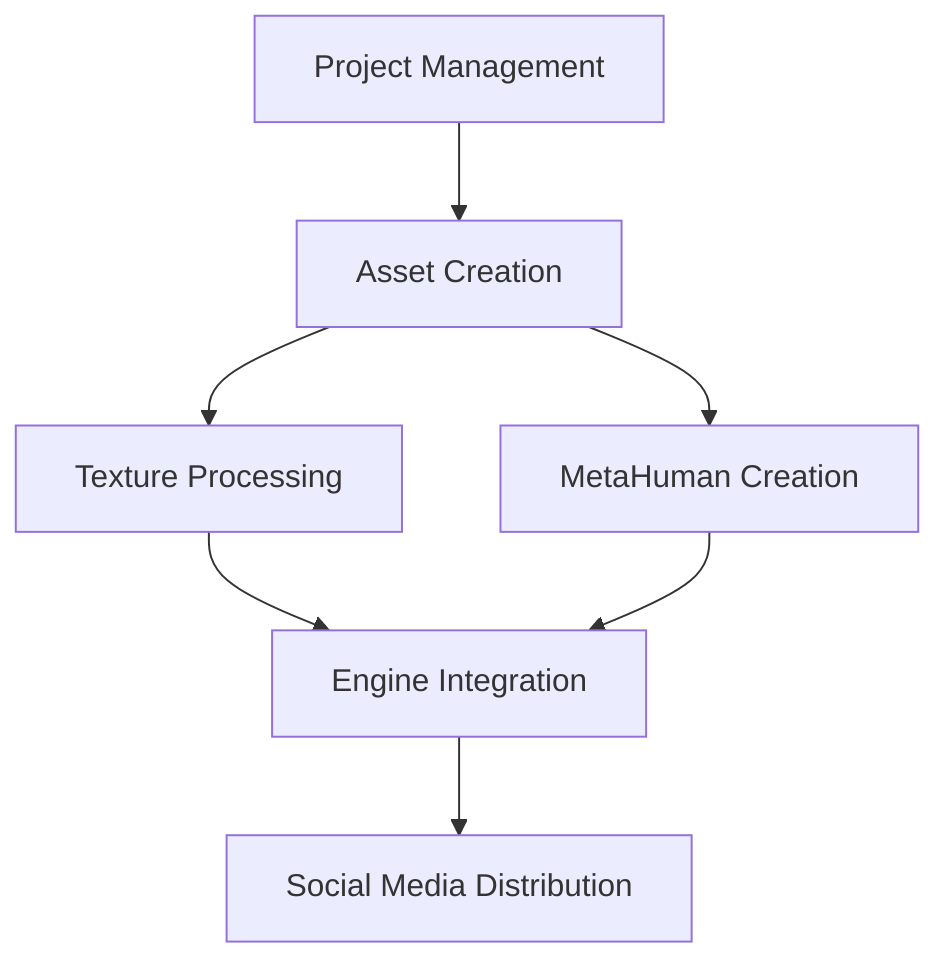
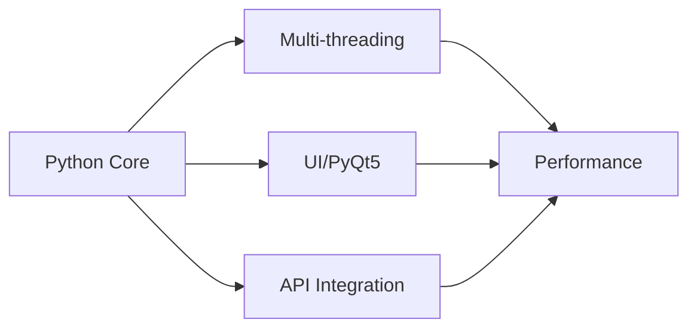

# 🎬 Production Pipeline Tools Suite

A comprehensive collection of production-grade tools designed for professional VFX and game development pipelines. This suite demonstrates advanced pipeline development capabilities including multi-threading, real-time processing, and seamless integration with industry-standard tools.

## 🎯 Pipeline Overview

## 🛠️ Tool Suites

### 📊 Project Tools
Advanced project management and organization system featuring:
- Automated project structure generation
- ftrack integration for production tracking
- Visual project configuration through PyQt5
- Comprehensive logging and error management

### 🎨 Texture Tools
High-performance texture processing system with:
- Multi-threaded batch processing
- Real-time progress visualization
- Memory-efficient large batch operations
- Automated folder structure creation

### 🤖 MetaHuman Tools
Sophisticated MetaHuman asset automation featuring:
- Parallel face and body animation processing
- Direct Unreal Engine API integration
- Custom asset registry management
- Automated import pipeline

### 🎮 Engine Tools
Unreal Engine pipeline integration suite offering:
- Smart version detection and management
- Multi-project support with health checks
- Custom launch configurations
- Production tracking integration

### 🎯 Asset Tools
Comprehensive asset management system including:
- Version control integration
- Asset validation and verification
- Automated naming convention enforcement
- Pipeline status tracking

### 📱 Social Media Tools
Data-driven social media analytics featuring:
- Multi-platform data collection
- Sentiment analysis
- Engagement metrics tracking
- Content performance analytics

## 🔧 Technical Architecture

## 🚀 Key Features
- **High Performance**: Multi-threaded processing across all tools
- **Production Ready**: Robust error handling and logging
- **User Friendly**: Intuitive GUI interfaces
- **Scalable**: Designed for large-scale production pipelines
- **Integrated**: Seamless connection with industry tools

## 📈 Pipeline Benefits
- Streamlined asset management
- Reduced manual operations
- Increased production efficiency
- Enhanced quality control
- Real-time progress tracking

## 🎨 User Interfaces

This suite features professionally designed, modern user interfaces across all tools:

### Project Tools
- Modern Qt-based project configuration interface
- Visual task management system
- Interactive project structure viewer

### Asset Tools
- Intuitive asset creation and management interface
- Real-time status updates
- Visual asset hierarchy viewer

### Texture Tools
- Multi-threaded processing interface
- Progress visualization
- Batch operation management

### MetaHuman Tools
- Sophisticated animation import interface
- Real-time progress tracking
- Visual error reporting

### Engine Tools
- Smart project management interface
- Version control integration
- Status monitoring dashboard

### Social Media Tools
- Interactive analytics dashboard
- Real-time data visualization
- Multi-platform monitoring interface

## 🔗 Dependencies
- Python 3.7+
- PyQt5
- Unreal Engine 5.x
- ftrack API
- Various tool-specific requirements

## 📝 License
MIT License - See LICENSE file for details

## 👨‍💻 Developer
Developed by Eric Fields (efieldsvfx@gmail.com)

## 📧 Contact
For questions or support, please contact: efieldsvfx@gmail.com
