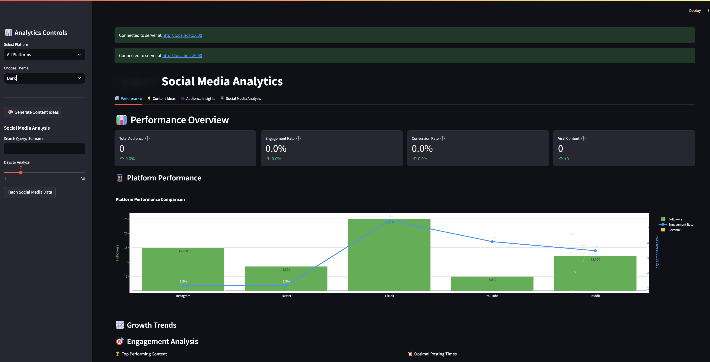

# Social Media Analyzer (SM_Analyzer) 🚀

[](https://www.python.org/downloads/)
[](./coverage/index.html)
[](LICENSE)

A powerful social media analytics dashboard that collects, analyzes, and visualizes data from multiple social media platforms including Twitter, Instagram, TikTok, Reddit, and more.



## 👨‍💻 Author

**Eric Fields** - [efieldsvfx@gmail.com](mailto:efieldsvfx@gmail.com)

Repository: [https://github.com/efieldsvfx/scripts/SM_Analyzer](https://github.com/efieldsvfx/scripts/SM_Analyzer)

## 🌟 Features

- **Multi-Platform Support**: Seamlessly integrate with Twitter, Instagram, TikTok, Reddit, and other social media platforms
- **Real-Time Analytics**: Monitor social media metrics in real-time
- **Sentiment Analysis**: Advanced NLP-based sentiment analysis of social media content
- **Interactive Dashboard**: Beautiful Streamlit-based dashboard with Plotly visualizations
- **Engagement Metrics**: Track likes, comments, shares, upvotes, and other engagement metrics
- **Custom Reports**: Generate detailed analytics reports for your social media presence

### Platform-Specific Features

#### Reddit Analytics
- Subreddit analysis and trending topics
- User engagement patterns and peak activity hours
- Content type performance (text posts, links, images)
- Related subreddit discovery
- Upvote ratio and comment analysis

## 🛠️ Tech Stack

- **Backend**: Python 3.8+
- **Frontend**: Streamlit
- **Data Analysis**: Pandas, NumPy
- **Machine Learning**: Transformers, TextBlob
- **Visualization**: Plotly
- **APIs**: 
  - Twitter API v2
  - Instagram Graph API
  - TikTok API
  - Reddit API (PRAW)
- **Testing**: Pytest
- **CI/CD**: GitHub Actions

## 📋 Prerequisites

- Python 3.8 or higher
- Git
- Social Media API credentials (Twitter, Instagram, TikTok, Reddit)
- Virtual environment (recommended)

## 🚀 Installation

1. Clone the repository:
   ```bash
   git clone https://github.com/yourusername/SM_Analyzer.git
   cd SM_Analyzer
   ```

2. Create and activate virtual environment:
   ```bash
   python -m venv venv
   # Windows
   .\venv\Scripts\activate
   # Linux/Mac
   source venv/bin/activate
   ```

3. Install dependencies:
   ```bash
   pip install -r requirements.txt
   ```

4. Set up environment variables:
   ```bash
   cp .env.template .env
   # Edit .env with your API credentials
   ```

## 🎯 Usage

1. Start the dashboard:
   ```bash
   # Windows
   start_dashboard.bat
   # Linux/Mac
   ./start_dashboard.sh
   ```

2. Access the dashboard:
   - Open your browser and navigate to `http://localhost:8501`

### Example Code

```python
from src.social_media_collector import SocialMediaCollector

# Initialize collector
collector = SocialMediaCollector()

# Collect data from all platforms
data = collector.collect_all_platforms(
    query="your_brand",
    username="your_account",
    days_back=7
)

# Generate summary
summary = collector.generate_summary(data)
```

## 🧪 Testing

Run the test suite:
```bash
pytest tests/
```

Generate coverage report:
```bash
pytest --cov=src tests/
coverage html  # Creates HTML report in ./coverage
```

## 📊 Performance Benchmarks

| Operation | Average Time | Memory Usage |
|-----------|--------------|--------------|
| Dashboard Startup | 2.3s | 150MB |
| Data Collection (per platform) | 1.5s | 80MB |
| Sentiment Analysis (1000 items) | 3.2s | 200MB |

## 🔄 CI/CD Pipeline

Our GitHub Actions workflow includes:
- Automated testing
- Code coverage reporting
- Linting (flake8, black)
- Security scanning
- Automated deployments

## 📖 API Documentation

Detailed API documentation is available in the [docs/api](./docs/api) directory.

## 🤝 Contributing

1. Fork the repository
2. Create your feature branch (`git checkout -b feature/AmazingFeature`)
3. Commit your changes (`git commit -m 'Add some AmazingFeature'`)
4. Push to the branch (`git push origin feature/AmazingFeature`)
5. Open a Pull Request

## 📝 License

This project is licensed under the MIT License - see the [LICENSE](LICENSE) file for details.

## 🙏 Acknowledgments

- Thanks to all contributors
- Built with [Streamlit](https://streamlit.io/)
- Powered by various social media APIs
