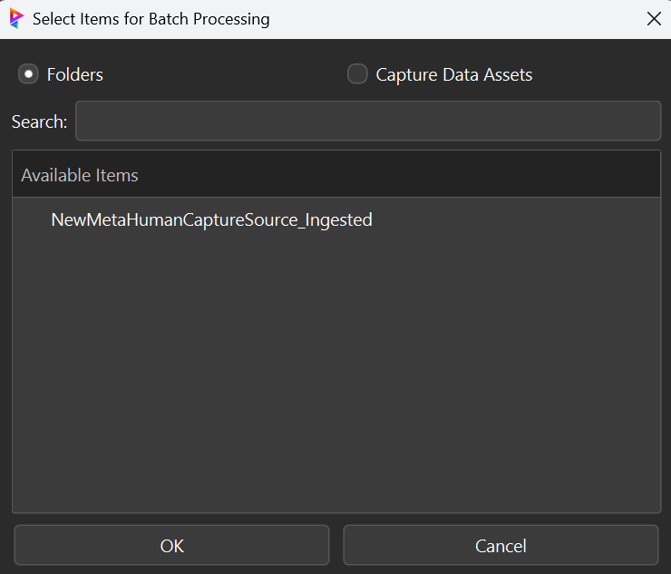
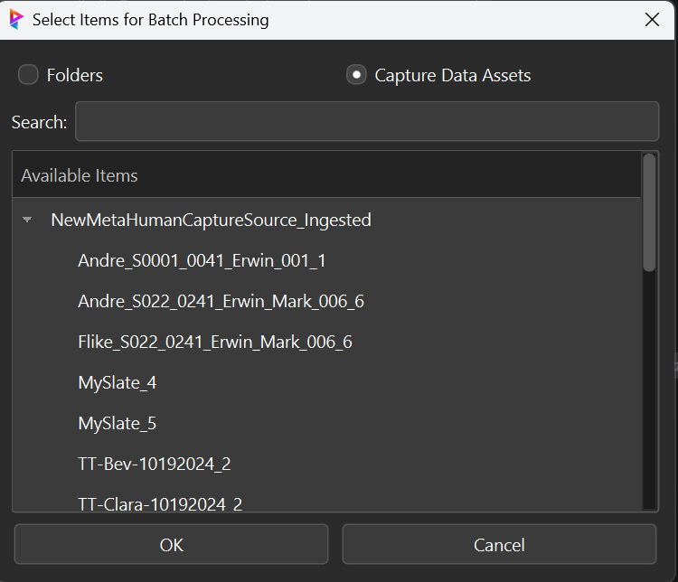
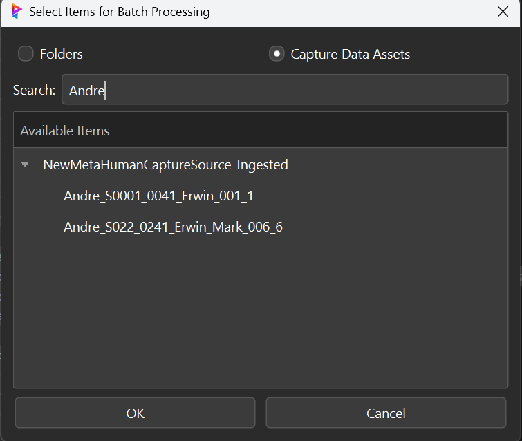
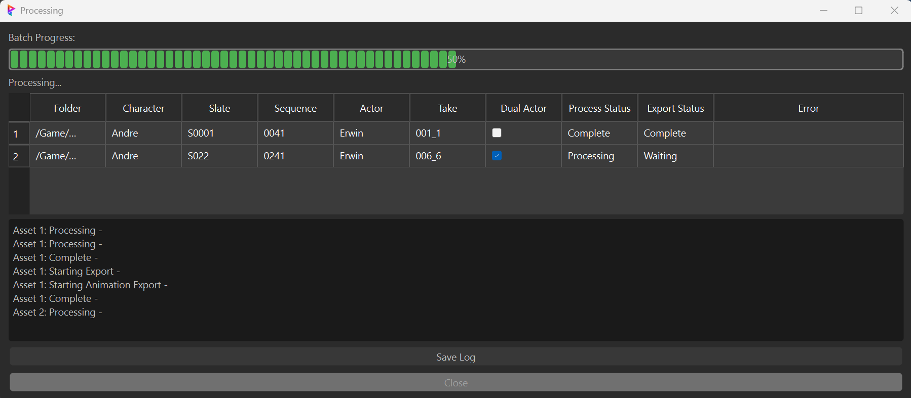
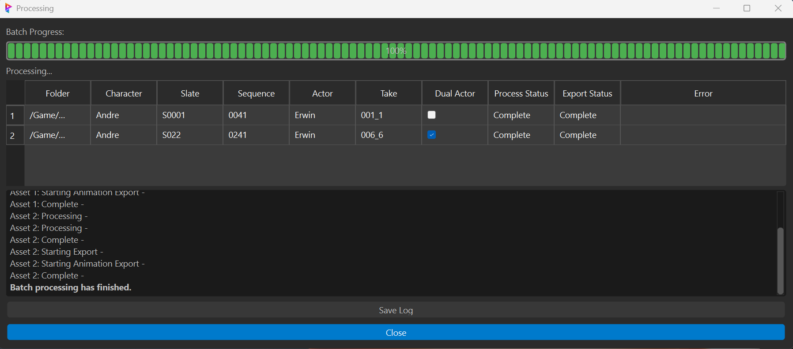
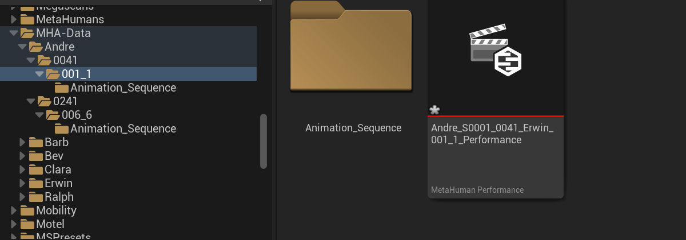
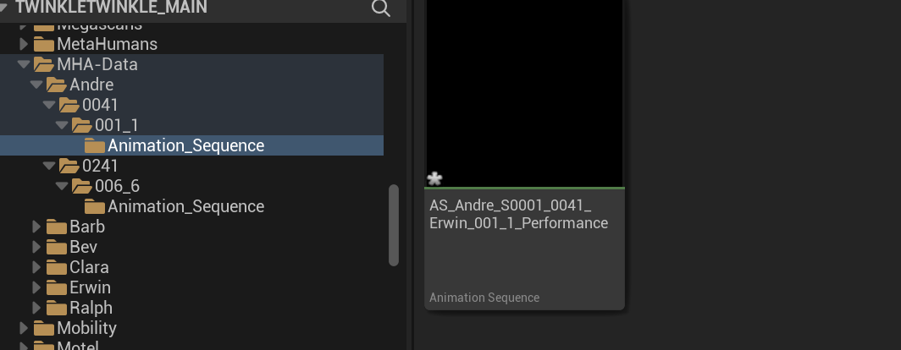

# Unreal Engine Metahuman Tools

Advanced Metahuman batch import and management tools for Unreal Engine. Last Updated: December 19, 2024

## 🎭 Components

### Batch Importer (`MHA_Batch_Importer/`)
- **Batch Processing**
  - Multiple metahuman import
  - Asset validation
  - Progress tracking
  - Error handling

- **Pipeline Integration**
  - Project structure management
  - Asset organization
  - Version control
  - Logging system

## 🔧 Features

### Asset Management
- Batch metahuman importing
- Asset organization
- Version tracking
- Progress monitoring

### Pipeline Integration
- Project structure setup
- Asset validation
- Error handling
- Logging system

### User Interface
- Modern Qt interface
- Progress visualization
- Error notifications
- Status updates

## 📸 Visual Guide

### Batch Import Workflow
1. **Select Import Type**  
   Choose between face or body animation import modes:
   

2. **Input Selection**  
   Either select folders for bulk import:
   

   Or choose specific capture data assets:
   

3. **Asset Search**  
   Use the search functionality to filter assets:
   

4. **Processing**  
   Monitor real-time import progress:
   

5. **Completion**  
   Review completed imports:
   

6. **Results in Unreal Engine**  
   Processed performance in the engine:
   

   Generated animation sequence:
   

## 💻 Requirements
- Unreal Engine 5.4+
- Python 3.7+
- Qt/PySide2
- Network access for asset management

## 🚀 Usage

```python
from Metahuman_tools import batch_importer
batch_importer.run_batch_import()
```

## 📝 License
Internal use only - All rights reserved.

## Author
**Eric Fields** - Pipeline Technical Director  
Contact: [efieldsvfx@gmail.com](mailto:efieldsvfx@gmail.com)
