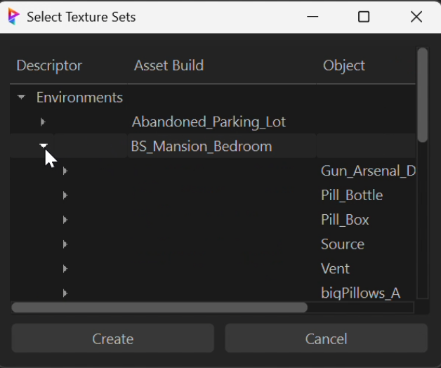
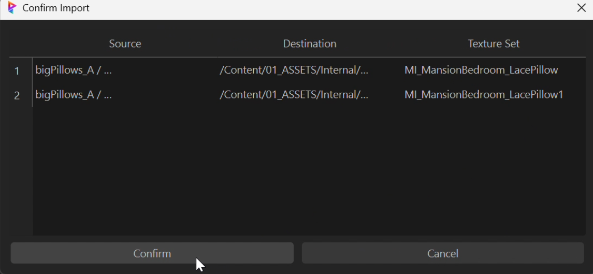

# Unreal Engine Texture Tools

Advanced texture and material management tools for Unreal Engine. Last Updated: December 19, 2024

## 🎨 Components

### Material Creator (`material_creator.py`)

#### Step 1: Select Texture Sets

- Choose texture sets for material creation
- Select multiple sets for batch processing

#### Step 2: Material Integration

- Automated material setup in folder structure
- Material instance creation and attachment
- Validation and error checking

### Texture Importer (`texture_import.py`)

#### Step 1: Asset Selection

- Browse and select assets for import
- Filter by type and category
- Preview selected items

#### Step 2: Import Confirmation

- Review selected assets
- Confirm import settings
- Start batch processing

## 🔧 Features

### Material Management
- Qt-based material creator
- Texture set organization
- Batch processing support
- Progress tracking

### Texture Processing
- Multi-threaded importing
- Memory-efficient operations
- Error recovery system
- Validation checks

### User Interface
- Modern Qt interface
- Dark theme support
- Progress visualization
- Error notifications

## 💻 Requirements
- Unreal Engine 5.4+
- Python 3.7+
- Qt/PySide2
- Thread-safe operations support

## 🚀 Usage

```python
# Material Creator
from Texture_tools import material_creator
material_creator.run_material_instance_creator()

# Texture Importer
from Texture_tools import texture_import
texture_import.run_texture_importer()
```

## 📝 License
Internal use only - All rights reserved.

## Author
**Eric Fields** - Pipeline Technical Director  
Contact: [efieldsvfx@gmail.com](mailto:efieldsvfx@gmail.com)
