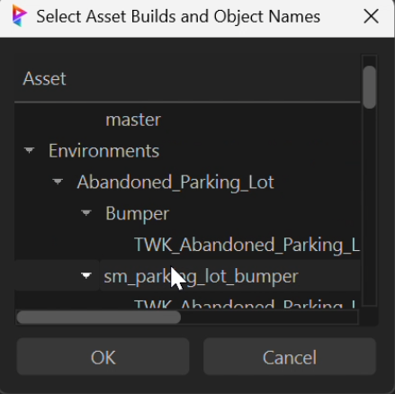
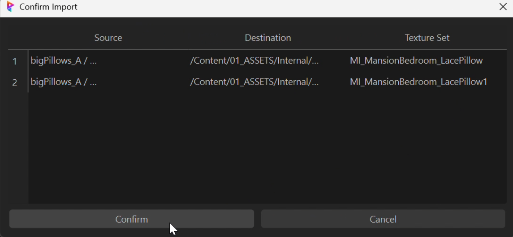
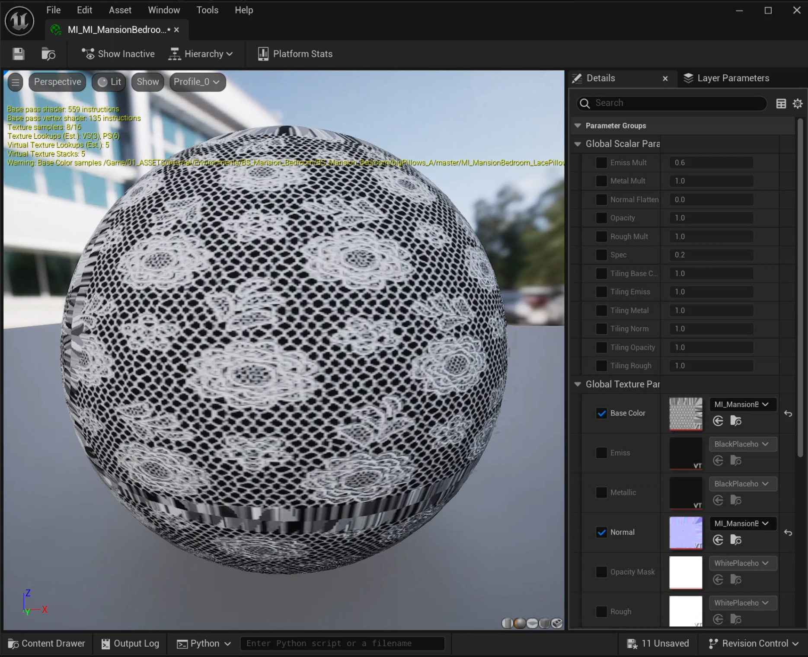
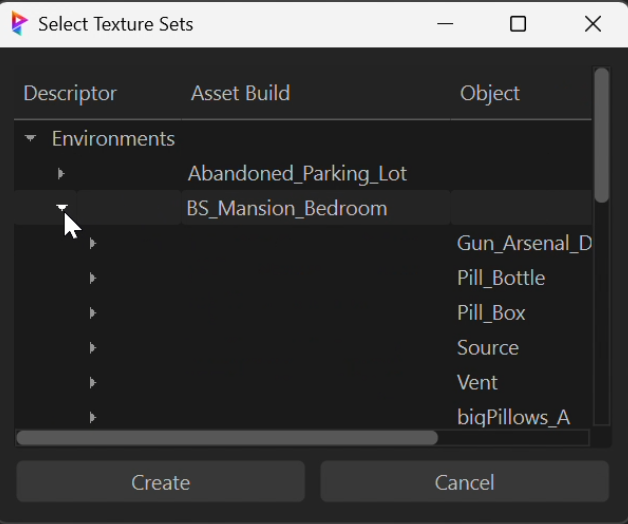

# Asset Tools Suite

## Overview
A sophisticated asset management toolkit designed for high-end VFX production pipelines, seamlessly integrating Unreal Engine, Prism Pipeline, and FTrack. This suite streamlines asset creation workflows and maintains production standards across multiple platforms.

## Core Components

### Asset Creator (`asset_creator.py`)
An advanced asset management system featuring:




#### Interface Features
- **Asset Management Interface**
  
  - Professional dark theme interface
  - Intuitive form layout
  - Smart input controls
  - Asset preview and version tracking

- **Smart Input Controls**
  - Project dropdown with dynamic loading
  - Asset type selection with predefined categories
  - Smart path generation

- **Asset Preview**
  - Real-time thumbnail generation
  - Quick view of asset details
  - Version history display

- **Pipeline Integration**:
  - Seamless Unreal Engine workflow
  - Prism Pipeline connectivity
  - Multi-pipeline support

The Asset Creator provides a streamlined interface for creating and managing assets across multiple pipeline systems, ensuring consistency and efficiency in asset creation workflows.

#### Technical Implementation
```python
# Example Asset Creation
asset_creator = AssetCreator(
    project="ProjectName",
    asset_type="Character",
    pipeline_options={
        "unreal": True,
        "prism": True
    }
)
```

### Material Creator (`material_creator.py`)
A sophisticated material management system integrated with Unreal Engine for automated material instance creation and management. This tool streamlines the process of creating material instances from texture sets.

#### Key Features
- **Smart Texture Set Detection**:
  - Automatically identifies texture sets without material instances
  - Intelligent parsing of texture naming conventions
  - Support for various texture types (BaseColor, Normal, etc.)

- **Hierarchical Asset Browser**:
  - Tree-based selection interface
  - Multi-select capability for batch processing
  - Organized by Descriptor/Asset Build/Object structure

- **Unreal Engine Integration**:
  - Direct integration with Unreal's Asset Registry
  - Automated material instance path generation
  - Batch material instance creation
  - Asset browser synchronization

#### User Interface Workflow
The Material Creator provides an intuitive, step-by-step interface for creating material instances:

1. **Asset Selection**
   
   - Hierarchical tree view of assets
   - Organized by Environment/Asset/Object structure
   - Multi-select support for batch operations

2. **Texture Set Selection**
   
   - Clear categorization by Descriptor, Asset Build, and Object
   - Intelligent filtering of available texture sets
   - Preview of selected items before creation

3. **Import Confirmation**
   
   - Review of source and destination paths
   - Clear display of texture set mappings
   - Final validation before material creation

4. **Material Editor Integration**
   
   - Direct integration with Unreal's Material Editor
   - Automatic parameter setup
   - Real-time preview of created materials

Each step provides clear visual feedback and maintains a consistent dark theme aligned with Unreal Engine's interface design.

#### Technical Implementation
```python
# Example Usage in Unreal Engine
material_creator = MaterialInstancePluginClass()
material_creator.get_texture_sets()  # Finds textures without material instances
material_creator.select_and_launch_batch_material_maker(selected_sets)
```




#### Workflow Integration
- Seamlessly integrates with Unreal Editor's menu system
- Supports both standalone and pipeline-integrated workflows
- Maintains consistent material instance naming and folder structure

## Technical Architecture

### API Integrations

#### FTrack API
```python
# Example FTrack integration
ftrack_manager = FtrackManager()
asset = ftrack_manager.create_asset(
    project_id="proj_123",
    name="hero_character_01",
    asset_type="Character"
)
```

#### Unreal Engine
```python
# Example Unreal integration
unreal_manager = UnrealManager(config)
unreal_manager.setup_asset(
    asset_type="Character",
    asset_name="hero_character_01",
    root_path="/Game/Characters"
)
```

#### Prism Pipeline
```python
# Example Prism integration
prism_manager = PrismManager(config)
prism_manager.setup_asset(
    asset_name="hero_character_01",
    root_path="/assets/characters"
)
```

## Key Features
- **Automated Workflow Integration**:
  - Cross-platform asset synchronization
  - Version control management
  - Production tracking
- **Standardized Asset Management**:
  - Consistent naming conventions
  - Structured folder hierarchies
  - Template-based creation
- **Quality Control**:
  - Automated validation checks
  - Error logging and reporting
  - Asset integrity verification

## Technical Requirements
- Python 3.7+
- Unreal Engine 5.x
- FTrack API Client
- PyQt5
- Prism Pipeline 2.x

## Pipeline Integration
The Asset Tools Suite serves as a crucial bridge between:
- Content Creation Tools
- Version Control Systems
- Production Tracking (FTrack)
- Game Engine (Unreal)
- Pipeline Management (Prism)

## Production Benefits
- **50% Reduction** in asset setup time
- **Standardized Workflows** across departments
- **Real-time Production Tracking**:
- **Error Prevention** through automation
- **Seamless Integration** with existing pipelines

## Future Development
- Expanded DCC tool integration
- Advanced asset analytics
- Machine learning-based asset validation
- Extended API capabilities

## Contact
For technical inquiries or pipeline integration support, please contact the Pipeline Development Team.

## Author
**Eric Fields** - Pipeline Technical Director  
Contact: [efieldsvfx@gmail.com](mailto:efieldsvfx@gmail.com)
