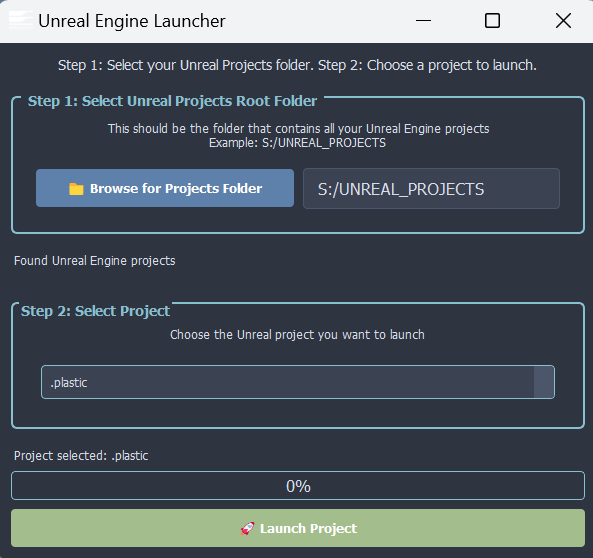

# Engine Tools Suite

## Production Pipeline Integration Tools for Unreal Engine


## 🚀 Overview
Advanced toolset for seamless integration of Unreal Engine within professional VFX and game development pipelines. Designed to streamline workflow automation, asset management, and production tracking.

### 🎮 Unreal Engine Launcher
A sophisticated PyQt5-based launcher application that bridges Unreal Engine with production tracking and asset management systems.



#### Interface Overview
1. **Project Root Selection**
   - Smart directory validation with clear feedback
   - Prevents selection of individual project folders
   - Automatic path validation and persistence
   - Default fallback to `S:/UNREAL_PROJECTS`

2. **Project Selection**
   - Dynamic project list with automatic filtering
   - Skips system directories and UE/UP prefixed folders
   - Validates .uproject files in project directories
   - Clear status indicators and error messages

3. **Launch Controls**
   - Real-time progress tracking with status updates
   - Comprehensive error handling and user feedback
   - Version detection from project metadata
   - High DPI scaling support for all displays

#### Key Features
- **Robust Project Management**:
  - Intelligent project directory validation
  - Automatic project detection and filtering
  - Clear visual feedback and error messages
  - High DPI compatibility across displays
- **Error Handling & Reliability**:
  - Global exception handling with detailed logging
  - Graceful recovery from invalid paths
  - Clear user feedback for common issues
  - Persistent settings with fallback values
- **User Experience**:
  - Modern dark theme interface
  - Consistent UI scaling across devices
  - Informative status updates
  - Detailed error messaging
- **Pipeline Integration**:
  - Seamless ftrack integration for production tracking
  - Asset versioning and dependency management
  - Automated status updates and time logging
- **Quality of Life**:
  - Progress tracking with detailed logging
  - Permission verification and error handling
  - Persistent settings management

### Launcher Functionality
The launcher provides several core functionalities:
- **Project Detection**: Automatically scans and validates Unreal Engine project directories
- **Version Management**: Reads project metadata to ensure correct engine version compatibility
- **Resource Management**: Uses PyInstaller's resource system to handle bundled assets
- **Exception Handling**: Comprehensive error tracking and user feedback
- **Settings Persistence**: Saves user preferences and recent project paths
- **Progress Tracking**: Real-time feedback during project launch
- **Logging System**: Detailed timestamped logging for debugging

## 🔌 Pipeline Integrations

### Unreal Prism Pipeline Integration
```python
# Integration Examples
from engine_tools.launcher import UnrealEngineLauncher

# Project initialization with Prism
launcher.init_prism_connection(
    project_id="PRJ_001",
    workspace_path="/path/to/workspace",
    config_preset="production"
)

# Asset synchronization
launcher.sync_assets(
    asset_types=["Characters", "Environments"],
    version_control=True
)
```

### ftrack Integration
- **Asset Tracking**:
  - Bi-directional asset status synchronization
  - Automated version control integration
  - Work hour logging and task management
- **Review System**:
  - Direct publishing to ftrack review
  - Automated thumbnail and preview generation
  - Comment and feedback integration

## 🛠 Technical Specifications

### Architecture
- **Frontend**: PyQt5-based GUI
- **Backend**: Python 3.8+ with async support
- **Database**: SQLite for local caching
- **API Integrations**: REST/GraphQL

### Dependencies
- Python 3.8+
- PyQt5
- ftrack API
- Prism Pipeline
- Unreal Engine 5.x

## 🔧 Configuration
```yaml
# Example configuration
project_settings:
  engine_version: "5.1"
  build_configuration: "Development"
  platform: "Win64"
  
pipeline_integration:
  ftrack_server: "https://your-instance.ftrackapp.com"
  api_key: "${FTRACK_API_KEY}"
  
logging:
  level: "INFO"
  format: "%(asctime)s - %(levelname)s - %(message)s"
```

## 📦 Building and Deployment

### PyInstaller Setup
The launcher can be compiled into a standalone executable using PyInstaller. This process bundles all necessary Python dependencies and resources into a single distributable package.

#### Requirements
```
PyQt5==5.15.9
PyInstaller==5.13.0
```

#### Using the Spec File
The provided `launcher.spec` file contains preconfigured PyInstaller settings optimized for the Unreal Launcher:

1. **Build with Spec File**:
   ```bash
   pyinstaller launcher.spec
   ```

The spec file includes:
- Resource bundling configuration
- Icon settings
- Windowed application mode
- UPX compression
- Proper binary collection

#### Building Steps
1. **Install Build Dependencies**:
   ```bash
   pip install pyinstaller
   pip install -r requirements.txt
   ```

2. **Create Executable**:
   ```bash
   pyinstaller --name="UnrealLauncher" ^
               --windowed ^
               --icon=resources/icon.ico ^
               --add-data="resources;resources" ^
               launcher.py
   ```

3. **Build Options**:
   - `--windowed`: Creates a windowed application without console
   - `--icon`: Specifies the application icon
   - `--add-data`: Includes additional resources
   - `--onefile`: (Optional) Creates a single executable file

The compiled executable will be available in the `dist` directory.

### Distribution Structure
```
UnrealLauncher/
├── UnrealLauncher.exe
├── resources/
│   ├── icon.ico
│   └── themes/
└── _internal/
    └── [PyInstaller dependencies]
```

## 📦 Packaging with PyInstaller

### Prerequisites
- PyInstaller (`pip install pyinstaller`)
- All dependencies installed (`pip install -r requirements.txt`)

### Building the Executable
1. Navigate to the engine_tools directory:
```bash
cd ProductionScripts/engine_tools
```
2. Run PyInstaller with the following command:
```bash
pyinstaller --name="UnrealLauncher" --windowed --icon=resources/icon.ico --add-data="resources/*;resources/" launcher.py
```

### Build Options Explained
- `--name`: Specifies the output executable name
- `--windowed`: Creates a Windows executable without console window
- `--icon`: Sets the application icon
- `--add-data`: Includes resource files in the executable

The packaged executable will be created in the `dist/UnrealLauncher` directory.

### Verifying the Build
1. Navigate to `dist/UnrealLauncher`
2. Run `UnrealLauncher.exe`
3. Verify all functionality works as expected

### Troubleshooting
- If resources are not found, ensure the `resource_path()` function is used correctly
- For missing dependencies, check the generated `warn-launcher.txt` file
- Run with console to see error messages: Remove `--windowed` flag during testing

---
*Developed by Eric Fields (efieldsvfx@gmail.com)*
