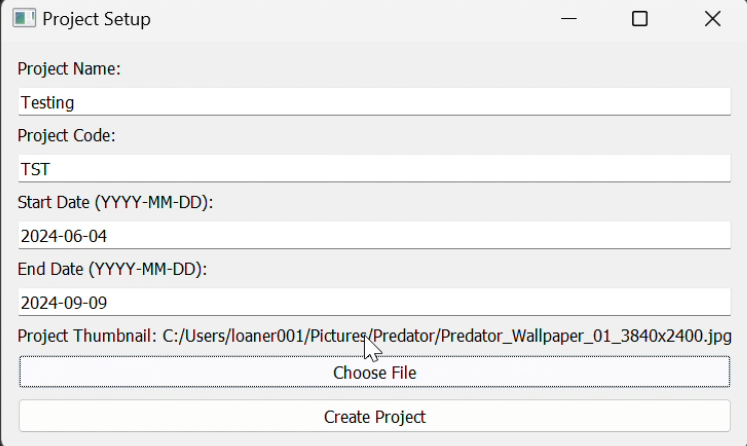
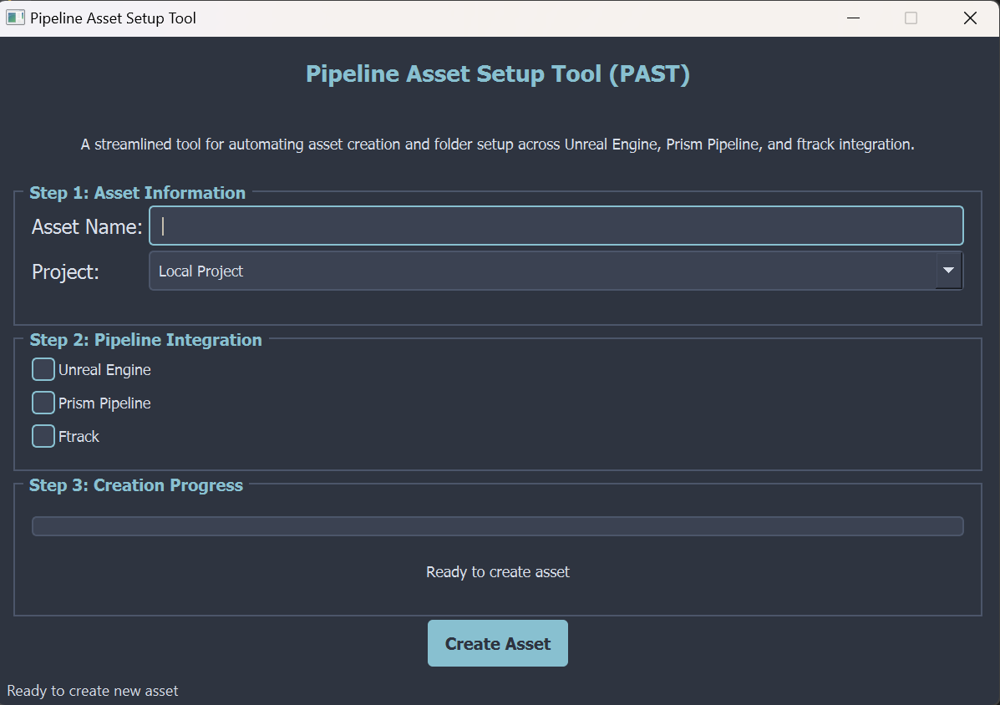

# Project Management Tools Suite

A sophisticated collection of production pipeline tools designed for efficient project management and task organization in VFX production environments. These tools seamlessly integrate with ftrack for robust project tracking and management.

## Core Components

### Project Setup Tool (`Project_setup.py`)

A powerful GUI-based utility for initializing and configuring new projects with automated project management integration.

#### Key Features
- **Project Management Interface**
  - Automated project structure creation
  - Direct ftrack integration
  - Visual configuration interface
- **Thumbnail Management**: Built-in support for project thumbnail handling using PIL
- **Robust Error Handling**: Comprehensive logging and error management system

#### Technical Implementation
- **Framework**: PyQt5 for responsive GUI
- **Project Management API**: ftrack_api for seamless project tracking
- **Image Processing**: PIL (Python Imaging Library) for thumbnail manipulation
- **Configuration**: JSON-based project templates and settings
- **Logging**: Structured logging system for debugging and monitoring

### Pipeline Asset Setup Tool (`asset_creator.py`)

A streamlined tool for automating asset creation and folder setup across Unreal Engine, Prism Pipeline, and ftrack integration.

#### Key Features
- **Modern User Interface**
  - Professional Nord theme dark interface
  - Compact, efficient layout
  - Three-step asset creation process
  - Real-time progress tracking

- **Pipeline Integration**
  - **Unreal Engine**: Automated folder structure and project setup
  - **Prism Pipeline**: Integrated workflow and asset management
  - **Ftrack**: Project tracking and asset status management
  - **Cross-Pipeline Compatibility**: Unified asset creation across multiple systems

- **Smart Asset Organization**
  - Standardized naming conventions
  - Automated folder hierarchy creation
  - Pipeline-specific configuration
  - Validation and error checking

#### Technical Implementation
- **Framework**: 
  - PyQt5 for modern GUI components
  - High DPI scaling support
  - Responsive layout management
  - Custom styled widgets

- **Design Features**:
  - Nord color theme (#2e3440 background, #88c0d0 accents)
  - Compact window size (600x400)
  - Efficient three-step interface
  - Progress tracking and status updates

- **Asset Management**: 
  - Configurable pipeline integrations
  - Automated asset structure creation
  - Real-time validation
  - Error handling and recovery

## Technologies Used

- **Python 3.x**: Core programming language
- **PyQt5**: Modern GUI framework
- **ftrack API**: Project management integration
- **JSON**: Configuration management

## Pipeline Integration

These tools are designed to seamlessly integrate into existing VFX pipelines:

- **Standardized Project Structure**: Ensures consistency across all projects
- **API-First Design**: Easy integration with other pipeline tools
- **Configurable Workflows**: Adaptable to different production requirements
- **Error Recovery**: Robust error handling and logging for production stability

## Use Cases

1. **Project Initialization**
   - Automated setup of new projects with standardized structures
   - Integration with production tracking systems
   - Configuration of project-specific settings

2. **Asset Management**
   - Streamlined asset creation across multiple pipelines
   - Automated folder structure generation
   - Pipeline integration validation
   - Progress tracking and status updates

## Performance Considerations

- **Efficient Resource Usage**:
  - Optimized file operations
  - Responsive UI design
  - Memory-efficient operations

- **Scalability**:
  - Handles multiple pipeline integrations
  - Fast asset creation and validation
  - Responsive interface during operations
