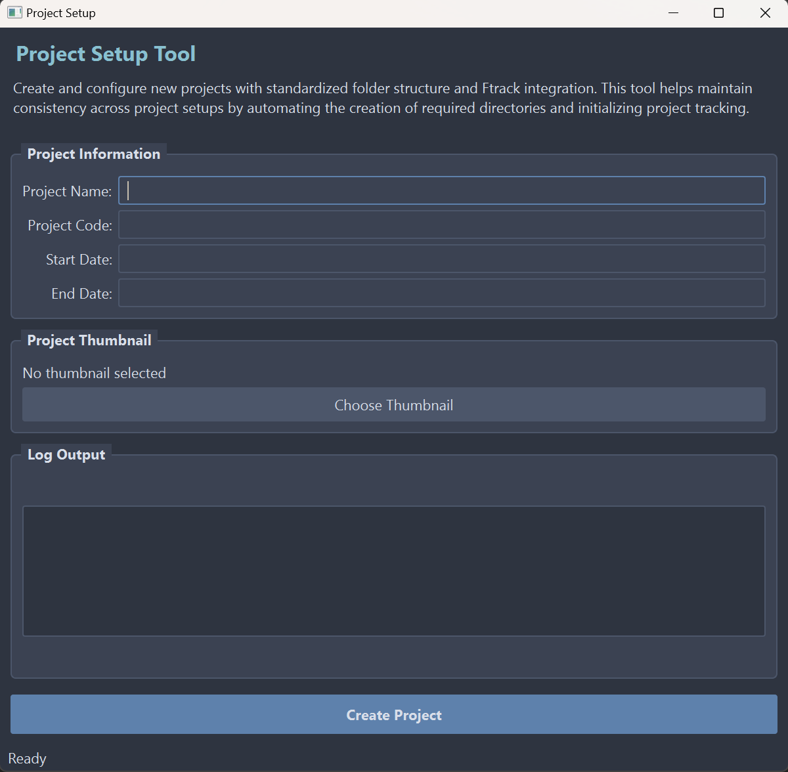

# Project Management Tools Suite

A sophisticated collection of production pipeline tools designed for efficient project management and task organization in VFX production environments. These tools seamlessly integrate with ftrack for robust project tracking and management.

## Core Components

### Project Setup Tool (`Project_setup.py`)

A powerful GUI-based utility for initializing and configuring new projects with automated project management integration. Features a modern, dark-themed interface consistent with the Pipeline Asset Setup Tool.

#### Key Features
- **Modern User Interface**
  - Professional Nord theme dark interface (#2e3440 base, #3b4252 elements)
  - Compact, efficient layout (600x500)
  - Intuitive project information form with real-time validation
  - Status bar for live feedback
  - Consistent styling with pipeline tools

- **Project Management Interface**
  - Automated project structure creation
  - Direct ftrack integration
  - Visual configuration interface
  - Streamlined thumbnail management with image preview
  - Clear project status feedback through status bar

- **Core Functionality**
  - JSON-based configuration management
  - Automated folder hierarchy creation
  - Ftrack project initialization and tracking
  - PIL-based thumbnail processing
  - Comprehensive error handling with visual feedback

#### Technical Implementation
- **Framework**: PyQt5 with High DPI scaling
- **UI Design**:
  - Nord color theme implementation
  - Responsive form layouts with proper spacing
  - Status bar integration for live feedback
  - Grouped interface sections with consistent styling
- **Project Management API**: ftrack_api for project tracking
- **Image Processing**: PIL for thumbnail manipulation
- **Configuration**: JSON-based project templates
- **Logging**: Visual feedback through status bar and log window

### Pipeline Asset Setup Tool (`asset_creator.py`)

A streamlined tool for automating asset creation and folder setup across Unreal Engine, Prism Pipeline, and ftrack integration.

#### Key Features
- **Modern User Interface**
  - Professional Nord theme dark interface
  - Compact, efficient layout (600x400)
  - Step-by-step asset creation process
  - Real-time progress tracking
  - Status bar integration

- **Pipeline Integration**
  - **Unreal Engine**: Automated folder structure and project setup
  - **Prism Pipeline**: Integrated workflow and asset management
  - **Ftrack**: Project tracking and asset status management
  - **Cross-Pipeline Compatibility**: Unified asset creation across multiple systems

- **Smart Asset Organization**
  - Standardized naming conventions with validation
  - Automated folder hierarchy creation
  - Pipeline-specific configuration
  - Real-time validation and error checking

#### Technical Implementation
- **Framework**: 
  - PyQt5 with High DPI scaling
  - Responsive layout management
  - Custom styled widgets
  - Status bar integration

- **Design Features**:
  - Nord color theme (#2e3440 background, #3b4252 elements)
  - Compact window sizing
  - Progress tracking with visual feedback
  - Consistent styling across components

- **Asset Management**: 
  - Configurable pipeline integrations
  - Automated asset structure creation
  - Real-time validation
  - Error handling with visual feedback

## Technologies Used

- **Python 3.x**: Core programming language
- **PyQt5**: Modern GUI framework with High DPI support
- **ftrack API**: Project management integration
- **PIL**: Image processing
- **JSON**: Configuration management

## Pipeline Integration

These tools are designed to seamlessly integrate into existing VFX pipelines:

- **Standardized Project Structure**: Ensures consistency across all projects
- **API-First Design**: Easy integration with other pipeline tools
- **Configurable Workflows**: Adaptable to different production requirements
- **Error Recovery**: Robust error handling and logging for production stability

## Use Cases

1. **Project Initialization**
   - Automated setup of new projects with standardized structures
   - Integration with production tracking systems
   - Configuration of project-specific settings

2. **Asset Management**
   - Streamlined asset creation across multiple pipelines
   - Automated folder structure generation
   - Pipeline integration validation
   - Progress tracking and status updates

## Performance Considerations

- **Efficient Resource Usage**:
  - Optimized file operations
  - Responsive UI design
  - Memory-efficient operations

- **Scalability**:
  - Handles multiple pipeline integrations
  - Fast asset creation and validation
  - Responsive interface during operations
