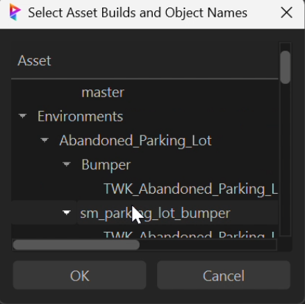

# Asset Tools Suite

## Overview
A sophisticated asset management toolkit designed for high-end VFX production pipelines, seamlessly integrating Unreal Engine, Prism Pipeline, and FTrack. This suite streamlines asset creation workflows and maintains production standards across multiple platforms.

## Core Components

### Asset Creator (`asset_creator.py`)
An advanced asset management system featuring:




#### Interface Features
- **Asset Management Interface**
  - Professional dark theme interface
  - Intuitive form layout
  - Smart input controls
  - Asset preview and version tracking

- **Smart Input Controls**
  - Project dropdown with dynamic loading
  - Asset type selection with predefined categories
  - Smart path generation

- **Asset Preview**
  - Real-time thumbnail generation
  - Quick view of asset details
  - Version history display

- **Pipeline Integration**:
  - Seamless Unreal Engine workflow
  - Prism Pipeline connectivity
  - Multi-pipeline support

The Asset Creator provides a streamlined interface for creating and managing assets across multiple pipeline systems, ensuring consistency and efficiency in asset creation workflows.

#### Technical Implementation
```python
# Example Asset Creation
asset_creator = AssetCreator(
    project="ProjectName",
    asset_type="Character",
    pipeline_options={
        "unreal": True,
        "prism": True
    }
)
```

### Texture Importer (`texture_import.py`)

A multi-threaded texture importing system for Unreal Engine with a sophisticated GUI interface.

#### Key Features
- **Multi-threaded Import**: Thread-safe texture importing with progress tracking
- **Batch Processing**: Efficient handling of large texture sets
- **Smart Folder Management**: Automatic folder creation and organization
- **GUI Integration**: 
  - Progress tracking dialog
  - Asset selection interface
  - Confirmation dialogs for large imports
- **Error Handling**: Comprehensive logging and error management
- **Pipeline Integration**: 
  - Unreal Engine compatibility
  - Support for various texture formats
  - Material instance checking

#### Technical Implementation
- **Threading**: Uses QThread and ThreadPoolExecutor for concurrent operations
- **GUI Framework**: PySide2 for responsive interface
- **Version**: v1.2.1
- **Safety Features**: 
  - Thread-safe operations with mutex locks
  - Batch processing for memory management
  - Prerequisite checking before imports

### Material Creator (`material_creator.py`)

A sophisticated Unreal Engine plugin for automated material instance creation and management, featuring a professional GUI interface.

#### Key Features
- **Material Instance Creation**
  - Batch creation of material instances from texture sets
  - Hierarchical texture set selection interface
  - Smart texture set organization
  
- **Unreal Engine Integration**
  - Direct integration with Unreal Editor menu system
  - Custom toolbar menu entries
  - Python-based command execution
  
- **User Interface**
  - Professional tree-based selection dialog
  - Multi-selection support
  - Dynamic column width adjustment
  - Resizable and maximizable windows
  
- **Pipeline Integration**
  - Project asset structure awareness
  - Logging system for operation tracking
  - Error handling and validation

#### Technical Implementation
- **Framework**: QtPy for cross-platform GUI compatibility
- **Version**: v1.0.0
- **Unreal Integration**:
  - Custom menu system integration
  - Tool menu entry management
  - Python command execution support
- **Asset Management**:
  - Hierarchical data structure
  - Texture set organization
  - Validation system for selections

## Technical Architecture

### API Integrations

#### FTrack API
```python
# Example FTrack integration
ftrack_manager = FtrackManager()
asset = ftrack_manager.create_asset(
    project_id="proj_123",
    name="hero_character_01",
    asset_type="Character"
)
```

#### Unreal Engine
```python
# Example Unreal integration
unreal_manager = UnrealManager(config)
unreal_manager.setup_asset(
    asset_type="Character",
    asset_name="hero_character_01",
    root_path="/Game/Characters"
)
```

#### Prism Pipeline
```python
# Example Prism integration
prism_manager = PrismManager(config)
prism_manager.setup_asset(
    asset_name="hero_character_01",
    root_path="/assets/characters"
)
```

## Key Features
- **Automated Workflow Integration**:
  - Cross-platform asset synchronization
  - Version control management
  - Production tracking
- **Standardized Asset Management**:
  - Consistent naming conventions
  - Structured folder hierarchies
  - Template-based creation
- **Quality Control**:
  - Automated validation checks
  - Error logging and reporting
  - Asset integrity verification

## Technical Requirements
- Python 3.7+
- Unreal Engine 5.x
- FTrack API Client
- PyQt5
- Prism Pipeline 2.x

## Pipeline Integration
The Asset Tools Suite serves as a crucial bridge between:
- Content Creation Tools
- Version Control Systems
- Production Tracking (FTrack)
- Game Engine (Unreal)
- Pipeline Management (Prism)

## Production Benefits
- **50% Reduction** in asset setup time
- **Standardized Workflows** across departments
- **Real-time Production Tracking**:
- **Error Prevention** through automation
- **Seamless Integration** with existing pipelines

## Future Development
- Expanded DCC tool integration
- Advanced asset analytics
- Machine learning-based asset validation
- Extended API capabilities

## Contact
For technical inquiries or pipeline integration support, please contact the Pipeline Development Team.

## Author
**Eric Fields** - Pipeline Technical Director  
Contact: [efieldsvfx@gmail.com](mailto:efieldsvfx@gmail.com)
